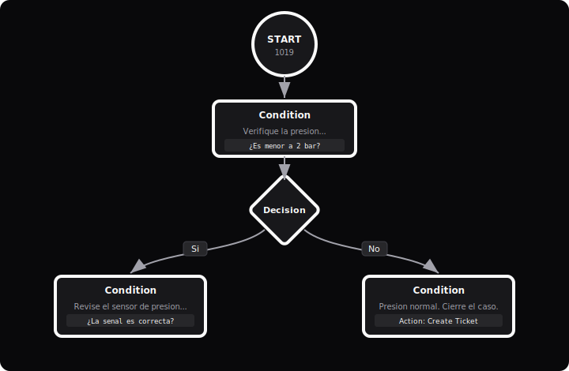
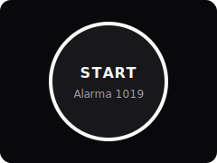
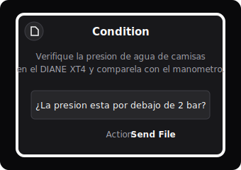
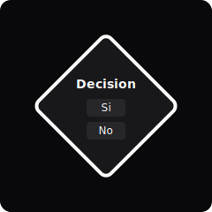
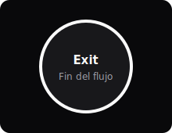
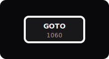
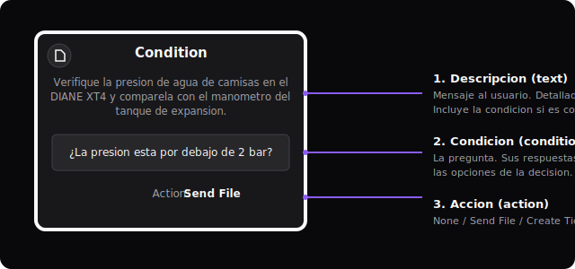

# Chatflow — Editor visual de flujos de alarmas PEGSA

Chatflow es una aplicación web (SPA) que permite **diseñar visualmente los flujos de
troubleshooting** de las alarmas PEGSA y exportarlos como archivos **YAML** listos para
ser consumidos por el [chatbot de soporte técnico](https://github.com/Innovaitors-SAS/chatbot-soporte-tecnico-pegsa).
En lugar de escribir el YAML a mano, el ingeniero arma el diagrama (nodos y conexiones)
en un lienzo, lo prueba con un simulador de chat integrado y descarga un `.zip`
desplegable que incluye el flujo y sus archivos de apoyo (PDF, imágenes, video).

> Producción: **https://chatflow.chatbotpegsa.com** (archivos estáticos servidos por Nginx).

---

## 📘 Manual de uso

¿Vas a construir o editar un flujo de alarma? Lee el **[Manual de uso de Chatflow](docs/MANUAL.md)**
— también disponible en **[PDF](docs/Manual-Chatflow.pdf)**. Explica con imágenes cada tipo de
nodo, qué se llena en cada uno y las reglas para que el flujo funcione bien en el chatbot.

El patrón base se repite a lo largo de todo el flujo:
`Start → Condition → Decision → (una rama por opción) → Condition → ...`



### Tipos de nodo

| Nodo | Representa | Qué se llena |
|------|-----------|--------------|
|  **Start** | Inicio del flujo (uno por alarma) | Código de alarma (4 dígitos) y tipo |
|  **Condition** | Mensaje + pregunta al usuario | Descripción, Condición (la pregunta) y Acción |
|  **Decision** | Las respuestas a la condición anterior | Opciones (Sí/No, numéricas…) |
|  **Exit** | Fin de un camino | — (se vuelve `next: "end"`) |
|  **Go To** | Salto a otra alarma | Código de alarma destino (4 dígitos) |

### El nodo de condición tiene 3 partes



### Reglas de oro

1. **Cada rama de una Decisión va a un nodo de Condición.**
2. **El campo *Condición* contiene la pregunta cuyas respuestas son exactamente las opciones**
   de la Decisión que sigue.
3. **La *Descripción* debe ser lo más detallada posible**; si es muy corta, incluye también la
   pregunta dentro de la descripción. Evita nodos con descripción vacía.
4. **Cierra todos los caminos** con un mensaje final (acción *Create Ticket*) seguido de un nodo **Exit**.
5. **Un nodo de Condición tiene una sola salida** hacia Decisión, Exit o Go To.

> El editor marca con un `!` amarillo los nodos mal configurados. Consulta el
> [manual completo](docs/MANUAL.md) para el detalle de validaciones, acciones, exportación y buenas prácticas.

---

## 1. Stack técnico

| Capa | Tecnología | Versión |
|------|-----------|---------|
| Framework UI | React | 19.1.0 |
| Build / dev server | Vite | 7.0.4 |
| Diagramación | ReactFlow (`reactflow`) | 11.11.4 |
| Resize de nodos | `@reactflow/node-resizer` | 2.2.14 |
| Layout automático | `dagre` | 0.8.5 |
| Generación/parseo YAML | `js-yaml` | 4.1.0 |
| Empaquetado ZIP | `jszip` | 3.10.1 |
| IDs únicos | `uuid` | 11.1.0 |
| Linting | ESLint | 9.30.1 |
| Runtime build | Node | 18 (alpine en Docker) |

Es una aplicación **100 % cliente**: no tiene backend propio. La persistencia es
`localStorage` y el intercambio de datos se hace vía export/import de `.zip`.

---

## 2. Arquitectura

```
chatflow/
├── src/
│   ├── main.jsx                     # Punto de entrada React
│   ├── App.jsx                      # Orquestador: layout, persistencia, import/export
│   ├── components/
│   │   ├── FlowDiagram.jsx          # Editor principal: estado de nodos/edges + generación YAML
│   │   ├── Sidebar.jsx              # Panel lateral con el YAML generado (resaltado)
│   │   ├── HelpTutorial.jsx         # Modal de ayuda / tipos de nodo
│   │   ├── nodes/
│   │   │   ├── StartNode.jsx        # Inicio de alarma (código + tipo)
│   │   │   ├── ConditionActionNode.jsx  # Paso con texto, condición y acción
│   │   │   ├── DecisionNode.jsx     # Bifurcación (sí/no u opciones)
│   │   │   ├── GoToNode.jsx         # Salto a otra alarma
│   │   │   └── GoToExitNode.jsx     # Fin del flujo
│   │   ├── edges/CustomEdge.jsx     # Conexiones con etiqueta editable
│   │   └── chatbot/                 # Simulador de chat para probar el flujo
│   │       ├── Chatbot.jsx
│   │       └── ChatMessage.jsx
│   └── index.css / App.css          # Tema (oscuro) y estilos
├── vite.config.js                   # Config Vite + middleware de escritura de index.yaml
├── Dockerfile                       # Build multi-stage que produce el bundle estático
├── index.yaml                       # Registro de alarmas de referencia
└── package.json
```

### Tipos de nodo

| Tipo | Forma | Datos | Propósito |
|------|-------|-------|-----------|
| `start` | Círculo | `alarmCode`, `alarmType` | Punto de entrada del flujo |
| `condition` | Rectángulo | `text`, `condition`, `action`, `file` | Paso del troubleshooting (puede enviar un archivo o crear ticket) |
| `decision` | Rombo | `options[]` | Bifurcación (sí/no o múltiples opciones) |
| `goto` | Rectángulo | `alarmCode` | Salta a otra alarma |
| `exit` | Círculo | `text` | Termina el flujo |

---

## 3. Formato de salida (YAML)

El diagrama se traduce en tiempo real a YAML con esta estructura:

```yaml
graph:
  id: "graph_alarm_1019"
  description: "1019"
  nodes:
    - id: "1019_start"
      text: "Esta es la Alarma 1019..."
      next: "confirm_pressure"
    - id: "confirm_pressure"
      text: "Presión de agua de camisas baja"
      decision:
        condition: "¿Es correcto?"
        yes: "verify_pressure"
        no: "verify_alarm_details"
    - id: "verify_pressure"
      text: "Verifique..."
      action: "Enviar Manual de usuario ..."   # dispara envío de archivo
      next: "siguiente_nodo"
```

Referencias soportadas en `next` / opciones de `decision`: id de nodo, `end`,
`goto__<CODE>` (saltar a otra alarma) y `create_ticket_in_db` (crear ticket).

---

## 4. Estructura del ZIP exportado

El botón de exportar genera `alarma<CODE>.zip` con el flujo y sus archivos de apoyo:

```
alarma1019.zip
├── alarma1019.yml              # Definición del flujo (YAML)
├── graph_layout_metadata.json  # Posiciones de los nodos + viewport (para reimportar)
└── extra_metadata/             # Archivos de apoyo (PDF, PNG, JPG, MP4, XLSX, ...)
    ├── manual_motor.pdf
    └── diagrama.png
```

Este `.zip` es exactamente la entrada que consume el script de deploy
`deploy_alarmas.sh` del proyecto del chatbot. El `.zip` se puede **reimportar** en
Chatflow para seguir editando un flujo existente (reconstruye nodos, posiciones y archivos).

---

## 5. Datos y configuración

- **Persistencia local:** `localStorage` bajo la clave `chatflow-data`
  (guarda nodos, edges, viewport y estado del sidebar, con auto-guardado debounced).
- **Variables de entorno** (`.env`):
  - `NODE_ENV`, `VITE_PORT` (puerto del dev server).
- **Integraciones externas:**
  - Enlace a la carpeta de SharePoint con los manuales/archivos de alarmas (botón "Archivos").
  - Referencia al bucket `s3://pegsa-chatbot/Flujos/` (almacenamiento de producción; el
    upload real lo hace el script de deploy, no esta app).

### Endpoint de desarrollo

En modo `dev`, `vite.config.js` expone un middleware:

| Método | Ruta | Propósito |
|--------|------|-----------|
| `POST` | `/api/update-index-yaml` | Escribe `index.yaml` localmente durante el desarrollo |

No existen endpoints HTTP en producción (la app se sirve como archivos estáticos).

---

## 6. Cómo correr

### Desarrollo

```bash
npm install
npm run dev        # http://localhost:5173
```

Otros scripts:

```bash
npm run build      # genera dist/ (bundle estático optimizado)
npm run preview    # sirve dist/ localmente
npm run lint       # ESLint
```

### Build con Docker

El `Dockerfile` es multi-stage: compila con `node:18-alpine` y deja el bundle
estático en `dist/` para servirlo con Nginx.

```bash
docker build -t chatflow-builder .
# copiar el contenido de /app/dist al servidor estático (chatflow-dist)
```

---

## 7. Despliegue (producción)

Chatflow se sirve como **archivos estáticos** desde Nginx en el servidor PEGSA:

- Dominio: `chatflow.chatbotpegsa.com` (HTTPS, TLS 1.2/1.3, certificado vía AWS ACM + PKCS#11 en enclave).
- `root` de Nginx: `/home/ubuntu/whatsapp_bot_pegsa/chatflow-dist`
  (la config vive en `whatsapp_bot_pegsa/nginx/sites-available/chatflow-app.conf`).
- Routing SPA: `try_files $uri $uri/ /index.html`.

Para actualizar producción: `npm run build`, copiar `dist/` al `chatflow-dist` del
servidor y recargar Nginx.

---

## 8. Cambios recientes

- **App servida de forma estática**: se ajustó el build para generar el bundle y
  desplegarlo como archivos estáticos detrás de Nginx (commit `3d74caa`).
- Validaciones del editor: nodos `decision` con todas sus opciones conectadas y sin
  duplicados; nodos `condition` con una sola salida hacia `decision`/`exit`/`goto`.
- Sanitización de nombres de archivo (quita tildes y caracteres especiales) para
  `extra_metadata/`.
- Resaltado del camino probado en el simulador de chat; deserialización correcta de
  objetos `File` desde `localStorage`.
