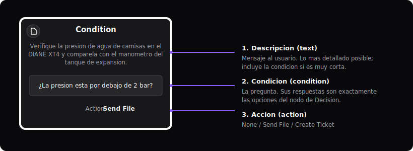

# Manual de uso de Chatflow

*Editor visual de flujos de troubleshooting de alarmas PEGSA*

Chatflow es el editor visual con el que se construyen los **flujos de troubleshooting**
de las alarmas PEGSA. En lugar de escribir YAML a mano, armas el diagrama con nodos y
conexiones, lo pruebas con el simulador de chat integrado y exportas un `.zip` que el
chatbot consume en producción.

Este manual explica **qué representa cada nodo, qué se llena en cada uno y las reglas que
debes seguir** para que el flujo funcione correctamente en el chatbot.

---

## 1. Flujo de trabajo de un vistazo

1. **Diseñar** el flujo en el lienzo (nodos + conexiones).
2. **Validar**: el editor marca con un signo `!` amarillo los nodos mal configurados.
3. **Probar** el recorrido con el simulador de chat (botón de chatbot).
4. **Exportar** el `.zip` de la alarma (`alarma<CÓDIGO>.zip`).
5. **Desplegar** ese `.zip` con el script `deploy_alarmas.sh` (sube a S3 + actualiza el índice del chatbot).

> Regla general: **todo camino del flujo debe terminar** en un nodo final (mensaje de
> cierre con acción *Create Ticket*) seguido de un nodo **Exit**.

---

## 2. Tipos de nodo

### 2.1 Inicio — *Start*


Marca el **comienzo del flujo** de una alarma. Hay **uno solo por flujo** y no se puede borrar.

**Qué se llena:**

- **Código de alarma** (`alarmCode`): el código de 4 dígitos (ej. `1019`).
- **Tipo de alarma** (`alarmType`): por defecto `warning`.

El código de Start define el `id` y la `description` del grafo en el YAML
(`graph_alarm_1019`).

---

### 2.2 Condición — *Condition*



Es el **nodo de trabajo** del flujo: muestra un mensaje al usuario y, normalmente,
hace una pregunta. Tiene **tres partes** (doble clic en el nodo para editarlas):

| Campo | Qué es | Cómo llenarlo |
|-------|--------|---------------|
| **1. Descripción** (`text`) | El mensaje que ve el usuario | Lo más **detallado** posible: instrucción clara, valores, ubicaciones, contactos. |
| **2. Condición** (`condition`) | La **pregunta** que se le hace al usuario | Una pregunta cuyas **respuestas son exactamente las opciones** del nodo de Decisión que sigue. |
| **3. Acción** (`action`) | Acción opcional al llegar al nodo | `None`, `Send File` (adjuntar PDF/imagen) o `Create Ticket` (crear ticket). |

Un nodo de Condición **siempre precede** a un nodo de **Decisión**, **Exit** o **Go To**
(tiene exactamente **una** conexión de salida).

---

### 2.3 Decisión — *Decision*


Contiene **las respuestas** a la pregunta planteada en el nodo de Condición anterior.

- Por defecto trae dos opciones: **Sí / No**.
- También pueden ser **numéricas** (`1`, `2`, `3`…) para menús, o de otro tipo.
- Las opciones deben ser **cortas y distintas entre sí**.

Cada opción de la Decisión se conecta con una rama del flujo. La **etiqueta** de cada
conexión que sale de la Decisión debe **coincidir** con una de sus opciones.

---

### 2.4 Salida — *Exit*


Marca el **fin de un camino**. Va justo **después** del nodo de Condición que da el
mensaje de despedida/cierre. En el YAML se traduce como `next: "end"`.

---

### 2.5 Salto — *Go To*


Sirve para **saltar a otra alarma**: indica qué alarma debe abrir el chatbot a
continuación.

- **Qué se llena:** el **código de 4 dígitos** de la alarma destino (ej. `1060`).
- Úsalo solo cuando el troubleshooting realmente continúa en otra alarma.

---

## 3. Cómo se conectan los nodos (reglas de conexión)


El patrón base se repite a lo largo de todo el flujo:

```
Start → Condition → Decision → (una rama por opción) → Condition → Decision → ...
```

- **Start → Condition.** El inicio entra a la primera condición.
- **Condition → una sola salida** hacia **Decision**, **Exit** o **Go To**.
- **Decision → una rama por cada opción**, y cada rama lleva (normalmente) a un nuevo
  **nodo de Condición**.

---

## 4. Reglas de oro

Estas son las reglas que **debes** respetar para que el flujo sea válido y el chatbot lo
interprete bien:

1. **Cada rama de una Decisión va a un nodo de Condición.**
   Las opciones (Sí/No, 1/2/3…) salen de la Decisión hacia condiciones que continúan el
   diagnóstico (o hacia un mensaje final + Exit).

2. **El campo *Condición* debe contener la pregunta cuyas respuestas son las opciones de la
   Decisión que sigue.**
   Si la Decisión tiene `Sí`/`No`, la condición es una pregunta de sí/no
   (*"¿La presión está por debajo de 2 bar?"*). Si la Decisión es numérica, la condición
   debe enumerar/preguntar por esas opciones.

3. **La *Descripción* debe ser lo más detallada posible.**
   Incluye instrucciones, valores, ubicaciones y contactos. **Si la descripción es muy
   corta, incluye también la pregunta (la condición) dentro de la descripción** para que el
   mensaje al usuario quede completo. Evita nodos con descripción vacía.

4. **Cierra todos los caminos.** Cada rama debe terminar en un mensaje final con acción
   **Create Ticket** seguido de un nodo **Exit** (o un **Go To** si continúa en otra alarma).

5. **Usa las acciones con criterio:** *Send File* para adjuntar el manual/diagrama que
   ayuda en ese paso; *Create Ticket* en los mensajes finales.

---

## 5. Validaciones automáticas (el `!` amarillo)

El editor marca los nodos con problemas. Estos son los avisos y cómo resolverlos:

**Nodo de Condición**

- *"Condition node is not connected to any other node."* → conéctalo a una Decisión/Exit/Go To.
- *"Condition node has more than one outgoing connection."* → debe tener **una sola** salida.
- *"Condition node must be connected to a Decision, Exit or Go To node."* → no conectes una
  condición directo a otra condición.

**Nodo de Decisión**

- *"Not all options are connected."* → falta conectar alguna opción.
- *"An outgoing connection's label does not match any defined option."* → la etiqueta de la
  conexión no coincide con ninguna opción; corrige el texto.
- *"There are duplicate option connections."* → hay dos conexiones con la misma etiqueta.

**Nodo Go To**

- *"Go To node must have a 4-digit alarm code."* → escribe un código de alarma de 4 dígitos.

---

## 6. Acciones del nodo de condición

| Acción | YAML generado | Cuándo usarla |
|--------|---------------|---------------|
| **None** | (sin `action`) | Paso normal del flujo. |
| **Send File** | `action: Enviar archivo <archivo>` | Para adjuntar un PDF/imagen/video de apoyo (manual, diagrama, ubicación). El archivo se sube en `extra_metadata/`. |
| **Create Ticket** | `action: "create_ticket_in_db"` | En los **mensajes finales**, para registrar el caso de soporte. |

---

## 7. Cómo se traduce a YAML

Un nodo de Condición con una pregunta y una Decisión Sí/No se exporta así:

```yaml
- id: "condition-1772816716797"
  text: "Antes de iniciar el troubleshooting, descargue y respalde los logs.
    Adjunto una instrucción técnica que le puede ayudar."
  action: Enviar archivo exportacion_de_parametros_diane_xt4_p.pdf
  decision:
    condition: "¿Confirma que descargó los logs?"
    yes: "condition-1771590122093"
    no:  "condition-1772817909063"
```

Un mensaje final (cierre + ticket) se exporta así:

```yaml
- id: "condition-1771528448343"
  text: "Comuníquese con la línea de soporte de PEGSA: 317 300 6466 ..."
  action: "create_ticket_in_db"
  next: "end"
```

- Una rama hacia **Exit** se vuelve `next: "end"`.
- Una rama hacia **Go To** se vuelve `next: goto_<CÓDIGO>`.
- Las opciones de la Decisión se vuelven las **claves** del bloque `decision`
  (`yes`/`no`, números, o la etiqueta en minúsculas con `_`).

---

## 8. Exportar, importar y desplegar

- **Exportar ZIP:** genera `alarma<CÓDIGO>.zip` con el flujo (`alarma<CÓDIGO>.yml`), las
  posiciones de los nodos (`graph_layout_metadata.json`) y la carpeta `extra_metadata/`
  con los archivos adjuntos. **Esta es la versión que se despliega.**
- **Importar ZIP:** vuelve a cargar un flujo existente para seguir editándolo (reconstruye
  nodos, posiciones y archivos).
- **Desplegar:** entrega el `.zip` al script `deploy_alarmas.sh`, que sube el contenido a
  `s3://pegsa-chatbot/Flujos/<CÓDIGO>/` y actualiza el índice del chatbot.

---

## 9. Probar el flujo (simulador de chat)

Abre el simulador integrado y recorre el flujo respondiendo como lo haría el usuario.
El editor **resalta el camino probado**, lo que ayuda a verificar que todas las ramas
llevan a un final correcto antes de exportar.

---

## 10. Buenas prácticas y errores comunes

**Haz esto:**

- Descripciones **detalladas**; si son cortas, incluye la pregunta dentro de la descripción.
- Condiciones redactadas como **preguntas** (terminan en `?`).
- Opciones de Decisión **cortas y distintas**; usa **Sí/No** por defecto y numéricas para menús.
- Cierra cada camino con **mensaje final + Create Ticket + Exit**.

**Evita esto (anti-patrones detectados en flujos reales):**

- **Nodos con descripción vacía** (se encontraron 340 en los flujos existentes): el usuario
  no recibe contexto.
- Opciones sin renombrar como `option_1`, `option_2`.
- Decisiones con una sola opción (no es una decisión real).
- Conectar una Condición directamente a otra Condición (debe haber una Decisión/Exit/Go To en medio).
- Caminos sin cierre (sin Exit / sin ticket final).

---

## Apéndice — Patrones reales (27 flujos analizados)

- **27 alarmas**, **1.191 nodos** (≈ 44 nodos por flujo).
- **773 decisiones**; el **93 %** son **Sí/No** (714), el resto numéricas (menús de 2 a 8 opciones).
- **89 %** de las condiciones están redactadas como pregunta (terminan en `?`).
- Acciones: **623** sin acción, **299** *Create Ticket*, **269** *Send File*.
- Finales: **389** ramas terminan en `next: end`; **Go To** se usa muy poco (continuidad entre alarmas puntual).
- Descripción: longitud media ≈ 176 caracteres (mediana 142). **340 nodos sin descripción** → oportunidad de mejora.
